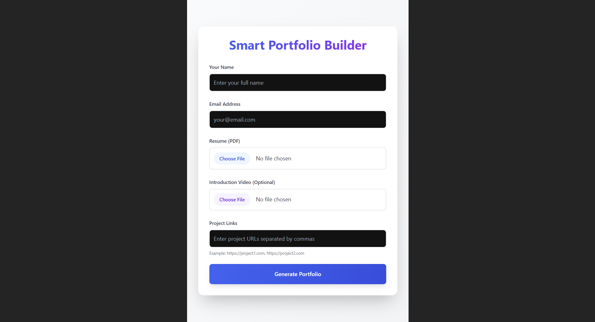
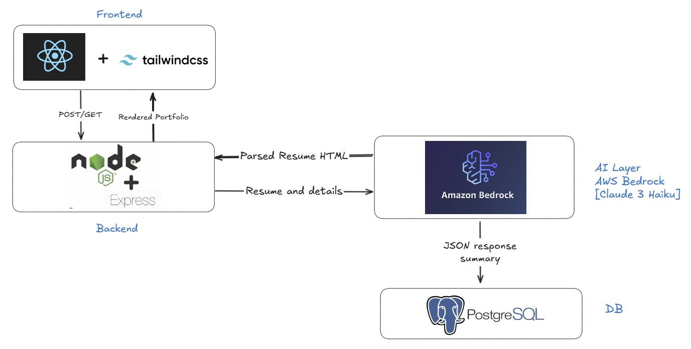

# 🧠 Smart Portfolio Builder

Smart Portfolio Builder turns resumes into interactive portfolio websites, helping job seekers, especially non-tech folks, showcase their skills, projects, and video pitch on one polished, shareable page.

### Knock it out in **under a minute**, portfolio done!

### 🎥 [Watch the Demo Video](https://drive.google.com/file/d/1hL-RY1Ll2yLeS6uBG8cE2Ql5iT9NQDsG/view?usp=drive_link)

## 🖼️ Preview

<p align="center"> 
     
</p>

<video width="600" controls>
  <source src="./src/assets/demo.mp4" type="video/mp4">
</video>

---
## ✨ Features

- 📝 Resume upload (PDF)
- 📽️ Optional video introduction [First Impression Pitch]
- 💡 AI-powered summarization using Claude 3 (AWS Bedrock)
- 🛠️ Project link bundling (GitHub, youtube, or any other website)
- ⚡ Clean, UI-ready output generated with React and TailwindCSS

## ⚙️ Architecture



## 🚀 Tech Stack

- **Frontend**: React + TailwindCSS
- **Backend**: Node.js + Express.js
- **Database**: PostgreSQL
- **AI Integration**: AWS Bedrock (Claude 3 Haiku)
- **File Uploads**: Multer

## 🛠️ Getting Started

Follow these steps to run the project locally:

### 1. Clone the Repo

```bash
git clone https://github.com/AKR-2803/smart-portfolio-builder.git
cd smart-portfolio-builder
```

### 2. Setup Backend

- Head to the `backend` directory, install necessary dependecies and create a `.env` file.

```bash
cd backend
npm install
touch .env
```

- Add your AWS credentials to `.env`:

```bash
AWS_ACCESS_KEY_ID=your_access_key
AWS_SECRET_ACCESS_KEY=your_secret_key
```

- Also set up PostgreSQL locally and create a database.

- Run the server

```bash
npm start
```
OR
```bash
node server.js
```


### 2. Setup Frontend

```bash
npm install
npm run dev
```

---

### Example Use

- Visit http://localhost:5173

- Fill in your name, email, project links

- Upload your resume (PDF)

- Upload a video pitch(optional)

- Click `Generate Portfolio`

---

## 💡Future Plans

- Provide multiple templates for users to choose from.
- Auto-pull GitHub project metadata


## 🤝 Contributing

- Feel free to fork, clone, and suggest improvements via pull requests! I welcome ideas around:
    - Enhanced resume parsing
    - UI design changes
    - LLM prompt engineering

---

### ⭐ If you like this project, consider giving it a star!
It helps others discover it and shows your support 🙌